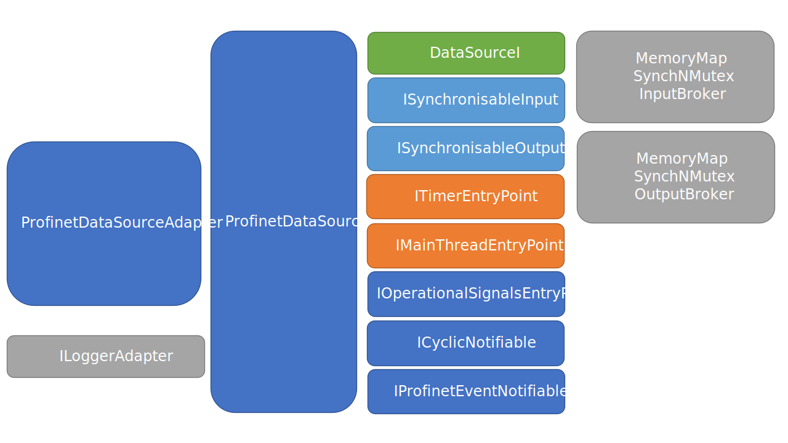
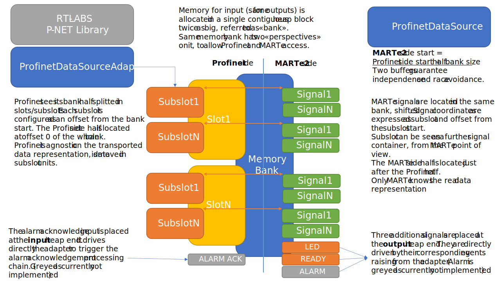
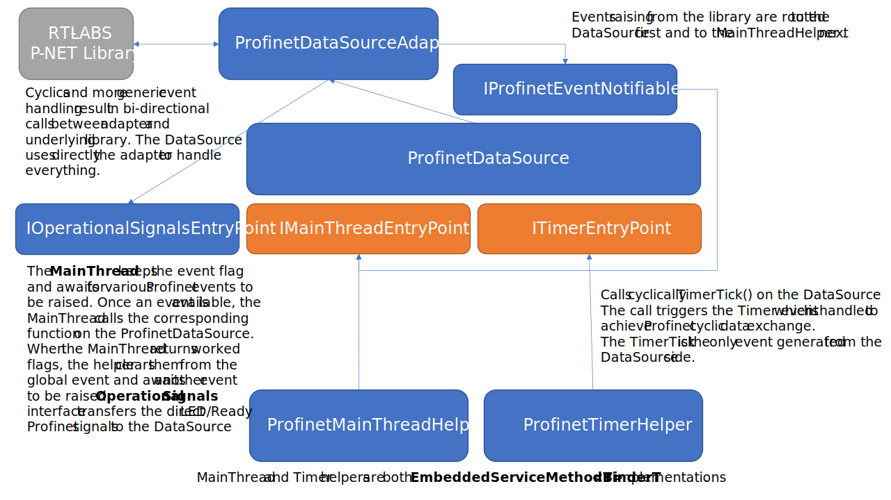
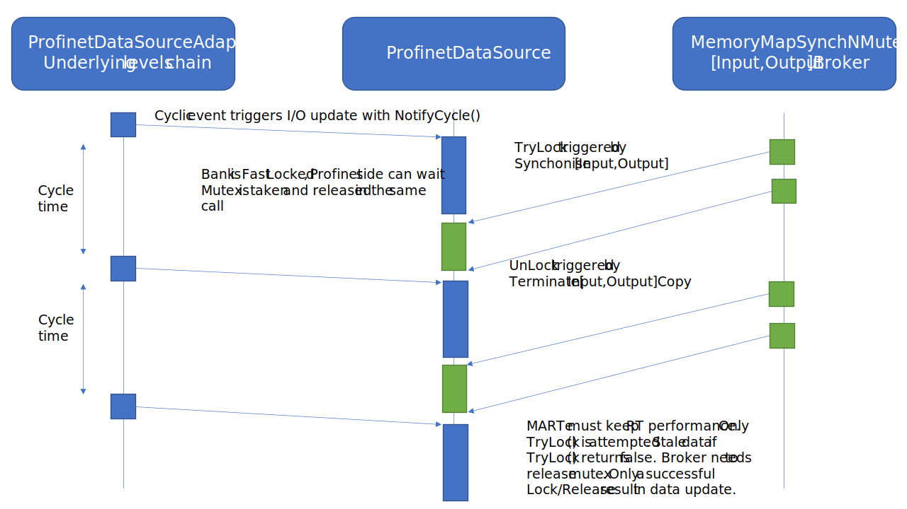
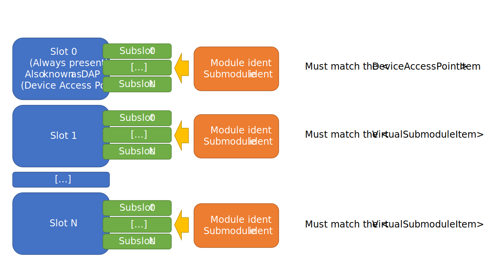
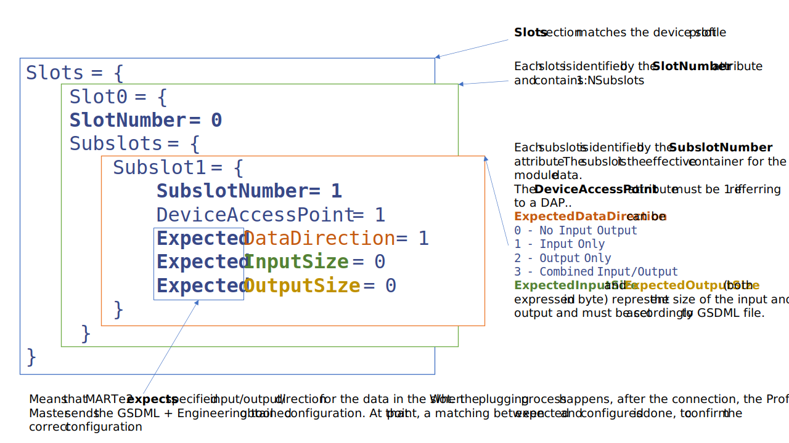
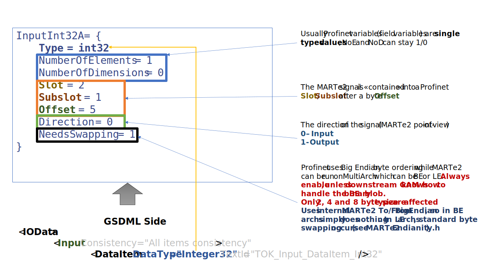
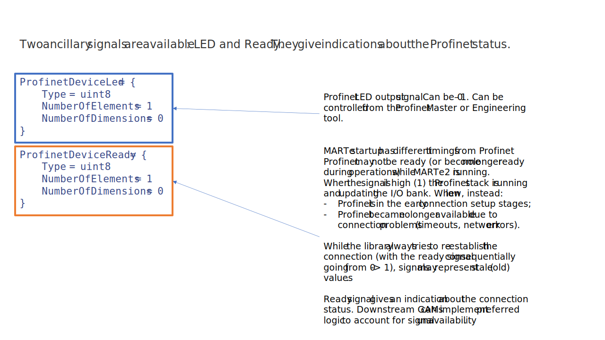

# Profinet DataSource
## Introduction
The *ProfinetDataSource* works as a Profinet slave in a Profinet bus. This DataSource appears in the Profinet bus as a real Profinet slave, by reflecting inputs and outputs to/from Profinet/MARTe.

The ProfinetDataSource is built upon the RT-LABS P-NET library available at [P-NET GITHUB Repository](https://github.com/rtlabs-com/p-net) which is a Profinet device stack implementation entirely written in C. The main requirement for the underlying Profinet stack is the **ability to send and receive raw, full sized, Ethernet L2 frames**.

When running, DataSource inputs become slave inputs while DataSource outputs become slave outputs. For extension, the DataSource becomes an I/O for the Profinet Master (PLC).

This document contains a reference about the implementation and the usage. It is structured as following.

[[toc]]

## Prerequisites
Before DataSource compilation and usage, the P-NET library must be compiled. In turn, the P-NET library requires OSAL to be compiled. Please ensure the two libraries are available in the LD_LIBRARY_PATH.

## General ProfinetDataSource structure
The ProfinetDataSource is structured in 3 layers:
- P-NET library
- ProfinetDataSourceAdapter
- ProfinetDataSource

*Main classes involved in ProfinetDataSource*

### P-NET library
The P-NET library is foundation for the ProfinetDataSource. Please refer to the [P-NET Documentation](https://rt-labs.com/docs/p-net/api_documentation.html) for further information. The library provides features for the connection, for the cyclic data exchange and for all the events which naturally occur during the stack lifecycle.
The P-NET library also needs OSAL (Operating System Abstraction Layer), which is also provided by RT-LABS [GitHUB OSAL](https://github.com/rtlabs-com/osal).
Note that the OSAL layer is an implementation for the various OS facilities which are needed by the Profinet stack (Mutex, Semaphores, etc.). Same (or similar) facilities are **already offered by MARTe2**, making the OSAL redundant and/or duplicated. In future releases the OSAL may be reworked (routing to MARTe2 functions) or removed from the P-NET library.

### ProfinetDataSourceAdapter
The ProfinetDataSourceAdapter is an adapter (not in strict GoF pattern definition) between the DataSource and the P-NET library which adapts the pure C library and I/O to MARTe2 suitable primitives. The adapter is a wrapper, in first instance, where all the functions and callbacks are mapped and an internal state is kept. It is initially designed to run independently from the datasource, although it is designed to fit into it. Moreover, the adapter has a subset of methods to easily map the process image.

### ProfinetDataSource
Aside from the MARTe2 mandatory implementations, the DataSource is reduced to 2 simple memory segment (1 for the inputs, 1 for the outputs) in which the following described things happen.
 
Initially:
- Each segment (input/output) is split into two halfs, one shared with the ProfinetDataSourceAdapter, the other exclusively accessed by MARTe2.

Every MARTe2 synchronisation checkpoint:
- the MARTe input part is copied inside the Profinet input part;
- the Profinet output part is copied inside the Profinet output part.
 
Mechanisms of callback, implemented in form of interfaces from the DataSource, are exposed to specific portions of the adapter, in order to propagate events from the library into the DataSource.
 
As the library, the adapter and the DataSource are mostly event-driven, all the relevant events are transported to and from the DataSource. Moreover, as a main source of events (the timer) is needed, timing facility is offered using the **EmbeddedServiceMethodBinderT** from MARTe2.

*Simplified DataSource memory layout*


### The Helpers (ProfinetMainThreadHelper and ProfinetTimerHelper)
For the ProfinetDataSource correct operations, two running services are needed. One is the timer, which ticks at a precise frequency generating the "Timer" event, the other is the Main, which monitors the "Event flag" containing all the possible Profinet occurring events. The Main thread stands still, waiting for an event to occur. Once an event has occurred, the right handler is executed. The vital event for the Profinet slave is the Timer event, which happens at a specific frequency, matching with the master specified (expected). The Timer event is generated inside the Timer helper and handled inside the MainThread. While no specific logic resides inside the helpers (excluding the trivial relevant logic), the real handling is always done at adapter level.

*Main Interactions between Helpers and DataSource*

### The brokers
ProfinetDataSource uses custom brokers, derived from the MemoryMap[Input,Output]Broker. They are similar to the MemoryMapSynchronised[Input,Output]Broker version with a difference in the Synchronise/Terminate phase. As concurrent access happens at DataSource level, on the shared heap devoted to process image, the DataSource initiates the copying (and the locking) inside the Synchronise call and terminates it signaling with the Terminate[Input,Output]Copy (unlock). Terminate[Input,Output]Copy methods are mildly abused in terms of MARTe intended usage, as they are called ignoring their calling parameters.


### Ancillary types
A series of ancillary types are used across the whole implementation. Every added feature to the DataSource is presented in form of interface, to avoid over-coupling and promote tidyness. Coupled ancillaries use the portion of interface of interest, instead of seeing the whole DataSource. Aside from interfaces, a _profinet_marte_signal_t_ is defined, as an accelerator structure where all the signals are conveniently stored together with Profinet specific and MARTe handy information. A double linked-list is also presented, with included forward and reverse iterator, to navigate signal structures.

## MARTe2 configuration file
As every MARTe2 component, the ProfinetDataSource requires a specific configuration file. In this specific case, the configuration file has some feature which must be *shared* with the Profinet GSDML file. Profinet peripherals are described using a file with an XML syntax (General Station Description Markup language). This description essentially contains some id's of the peripheral and a list of all the inputs/outputs that it offers. The GSDML is imported in the PLC engineering tool (usually the automation IDE) and allows the configuration of the peripheral communication with the master.
Aside from specific protocol details and in simple terms, what happens is:
- The module has slots and subslots, which are *virtual bays* that can contain modules and submodules;
- The engineering tool is used to configure the PLC master by importing the GSDML file. Essentially using what is described in the GSDML (a list of possible modules/submodules and their possible combinations in slots/subslots) is materialised in a configuration scheme;
- From the MARTe2 side, the ProfinetDataSource *expects* a configuration which is a combination of slot/subslot, a data direction and a byte size for each of them;
- When the Profinet stack is started in the DataSource underlying levels, a plugging event occurs, where master intended configuration is matched with the expected one;
- Once expected and master proposed configuration are matching, the cyclic communication starts. MARTe2 ProfinetDataSource **expects** a configuration (allocates memory, organizes raw heap in signals, etc.). Profinet master *sends* the configuration obtained from the GSDML and engineering tool. This is why an initial matching is done, to assess the right amount of memory is allocated on the Profinet stack side and on the MARTe side to allow signal data exchange.

**NOTE:** values are written as examples, feel free to change them, using the following rules.

*Plugging process simplified. Highlighted the GSDML places where parameters are matched against MARTe2 expected*

### Base configuration
This section contains the very basic Profinet stack configuration.
```
Class = ProfinetDataSource
NetworkInterface = "enp0s9" [1]
StationName = "rt-labs-dev" [2]
PeriodicInterval = 10000 [3]
ReductionRatio = 100 [4]
```
#### [1] Network interface
Network interface which will be dedicated to Profinet communication. Should be compliant to the P-NET stack requirements, above mentioned (ETH L2 full raw frame). P-NET library will automatically run a script called *set_network parameters* (see ProfinetDataSourceFolder) which will 
1. initially reset the IP address
2. do an IP address request to the Profinet Master
3. Acquire and set offered address to interface  

Ensure the user has the right permission to run commands inside set_network_parameters script (essentially ip / ipconfig command).  
**Note 1:** review the script to ensure compatibility with your platform and user permissions.  
**Note 2:** the script must be reachable from the MARTe2 executable path

#### [2] Station name
Profinet station name, which must match the key DNS_CompatibleName="rt-labs-dev« of the `ApplicationProcess/DeviceAccessPointList/DeviceAccessPointItem` in GSDML.
#### [3] Periodic interval
Profinet periodic interval specifying cyclic requests, expressed in microseconds. Should be set according to Profinet master expectancy and GSDML `ApplicationProcess/DeviceAccessPointList/MinDeviceInterval` item (which is instead expressed in 1/32 ms - 1/31.25 ms). Essentially, the master expects a cyclic update and times out after the watchdog expires.
#### [4] Reduction ratio
To avoid copying and updating data every cycle (which can be very strict), the slave can be kept online without updating the I/O image. This parameter sets how many cycles must pass before updating the whole process image (e.g. 1 means 1:1,100 means 1:100 or 1 update every 100 scan cycles).

### Base identification
Configuration keys in this section are related to the device identification. Keys [1] [2] [5] must match  the Profinet GSDML side, as depicted. Other keys ([3], [4], [6]) can be freely customized by the user, as they have no matching counterpart in the Profinet descriptor file.
```
VendorIdentifier = 0xFEED [1]
DeviceIdentifier = 0xBEEF [2]
OEMVendorIdentifier = 0xC0FF [3]
OEMDeviceIdentifier = 0xEE01 [4]
DeviceVendor = "rt-labs" [5]
ManufacturerSpecificString = "PNET demo" [6]
```
In square bracket the matching key between MARTe2 and GSDML, as shown below in the GSDML excerpt.
```
<DeviceIdentity VendorID="0xfeed[1]" DeviceID="0xbeef[2]">
    <InfoText TextId="IDT_INFO_Device"/>
    <VendorName Value="rt-labs[5]"/>
</DeviceIdentity>
```
### I&M Data
Identification and Maintenance data (I&M) allow access to data blocks for PROFINET device. I&M can be read using acyclic read/write record requests. Device name, location, maintenance information for this device can be stored in each device. Usually written with a programming/engineering tool or via read/write record requests under the control application.
P-NET, as currently, only supports I&M 1-4, see below exposed parameters.
Note that given strings are automatically truncated to the maximum supported lengths (maximum length is mandated by the RTLABS PNET library, see relevant pnet structures). I&M data is customizable but, in the actual version, any change from the engineering tool is only temporarily reflected in the stack (e.g. MARTe2 configuration file is not updated accordingly).

```
IMVendor = 0xFEED
IMHardwareRevision = 1
IMSoftwareRevision = 'V' [1]
IMFunctionalEnhancement = 1
IMBugFix = 0
IMInternalChange = 0
IMProfileIdentifier = 0x1234
IMProfileSpecificType = 0x5678
IMVersionMajor = 0
IMVersionMinor = 0
IMFunction = "" [2]
IMLocation = "" [3]
IMDate = "" [4]
IMDescriptor = "" [5]
IMSignature = "" [6]
```
**Note [1]:** Can only be a char from [‘V’, ‘R’, ‘P’, ‘U,’ ‘T’] set.  
**Note [2]:**  Truncated to 31 characters.  
**Note [3]:**  Truncated to 21 characters.  
**Note [4]:**  Truncated to 15 characters.  
**Note [5]:**  Truncated to 54 characters.  
**Note [6]:**  Truncated to 53 characters.  

### Network specifics
```
LLDPPortIdentifier = "port-001" [1]
RTClass2Status = 0 [2]
RTClass3Status = 0 [3]
AutoNegotiationCapability = 0x03 [4]
AutoNegotiationSpeed = 0x0010 [5]
MAUType = 0x00 [6]
```
**Note [1]:** LLDP identifier for the network port.  
**Note [2][3]:** RT Class 2/3 Status, leave them at 0, currently not used.  
**Note [4]:** AutoNegotiation capabilities, as following described:
- LSB bit 0 AutoNegotiation supported
- LSB bit 1 AutoNegotiation enabled  

**Note [5]:** AutoNegotiation speed, as following described flag can be combined, list not exhaustive:
- 1000BaseT Full duplex (1 << 0)
- 1000BaseT Half Duplex (1 << 1)
- 1000BaseX Full Duplex (1 << 2)
- 1000BaseX Half Duplex (1 << 3)
- 100BaseTX Full Duplex (1 << 10)
- 100BaseTX Half Duplex (1 << 11)
- 10BaseT Full Duplex (1 << 13)
- 10BaseT Half Duplex (1 << 14)
- Unknown autonegotiation  (1 << 15)

**Note [6]** Medium Attachment Unit (MAU) types, list not exhaustive:
- Radio 0x0000
- Copper 10BaseT 0x0005
- Copper 100BaseTX Half Duplex 0x000F
- 100BaseTX Full Duplex 0x0010
- 1000BaseT Half Duplex 0x001D
- 1000BaseT Full Duplex 0x001E
- 100BaseFX Half Duplex 0x0011
- 100BaseFX Full Duplex 0x0012
- Fiber 1000BaseX Half Duplex 0x0015
- Fiber 1000BaseX Full Duplex 0x0016

### MainThread and Timer helpers
Aforementioned MainThread and Timer helper are **EmbeddedServiceMethodBinderT** service implementations . They can be configured to be executed on specific CPU masks and with specific timeouts. Please refer to the EmbeddedServiceMethodBinderT documentation for specific details on the configuration.

```
+MainThreadHelper = {
    Class = ProfinetMainThreadHelper
    Timeout = 1000
    CPUMask = 0xFF
}

+TimerHelper = {
    Class = ProfinetTimerHelper
    Timeout = 1000
    CPUMask = 0xFF
}
```
### Slot and Subslot layout
This section describes the slots and subslot that the ProfinetDataSource virtual peripheral will plug on startup. The Slots and relative Subslot section strictly follows the GSDML description. The structure is a 2-level hierarchy where the N slots are siblings and contain related M subslots. The Device Access Point (DAP) is a Profinet characteristic slot located always at 0 position which is always present in the
Profinet devices and is mandatory.

```
Slots = {
    Slot0 = {
    SlotNumber = 0 [1]
    Subslots = {
        Subslot1 = {
            SubslotNumber = 1 [2]
            DeviceAccessPoint = 1 [3]
            ExpectedDataDirection = 1 [4]
            ExpectedInputSize = 0 [5]
            ExpectedOutputSize = 0 [6]
        }
     }
}
```
**Note [1]:** Represents the Profinet slot (in the specific example is the DAP slot).  
**Note [2]:** Represents the Subslot number. Alongside [1], the two values which represent the Profinet coordinates of the variables.  
**Note [3][4][5][6]:** DeviceAccessPoint is a special boolean attribute which instructs the underlying levels that the slot is a DAP. The other 3 attributes (direction, input size and output size), instead, describe the size of the Profinet I/O image for that specific module which is plugged in the slot/subslot. Sizes are expressed in bytes. DataDirection can be one of the following values:
- 0 No inputs and no outputs
- 1 Input only
- 2 Output only
- 3 Combined Input/Output

Refer to the cheat sheet for a graphical representation of this specific section parameters.
*Slot and subslot cheat sheet*

### MARTe2 signals layout
ProfinetDataSource follows standard MARTe2 signal conventions, but adds some keys which are related to the Profinet nature of the exhanged data. Profinet, in fact, exchanges data as whole block for the module/submodule and is totally agnostic about the number and nature of data carried inside. Significance of data is given by the user, which addresses variables inside the block. Same happens in MARTe2, where signals need attributes to locate signals inside slots and subslots, at specific offsets.
```
InputInt32A = {
    Type = int32
    NumberOfElements = 1
    NumberOfDimensions = 0
    Slot = 2
    Subslot = 1
    Offset = 5
    Direction = 0
    NeedsSwapping = 1
}
```
MARTe2 standard attributes are NumberOfElements and NumberOfDimensions, which, considering the signal nature (field variables) should stick at 1/0 like in the example.
Extended attributes need to address the signal in the raw data byte "blobs" which come from the Profinet stack. Refer to the cheat sheet for a graphical representation of this specific section parameters.
*Signals cheat sheet*

#### Ancillary signals
Two ancillary signals are available: LED and Ready. They give indications about the Profinet status. The LED gives information about the peripheral and can be controlled from the master and from the engineering tool. The ready signal is instead useful to avoid running downstream GAMs when no connection or association exists between the DataSource and the Profinet master. As during offline operations the DataSource keeps last valid data, using the ready signal enables downstream GAMs operation tell apart good from stale values.
*Ready and LED signal cheat sheet*

###  Frequently Asked Questions
**Q:** Why the properties are called with the "expected" prefix?  
**A:** Because they are matched with master advertised before plugging them into modules. MARTe2 expects a configuration, the Profinet master says what is configured with the engineering tool. At last, what the Profinet master says is the only thing that counts. That's why MARTe2 can only **expect** and match features. MARTe2 expectations, from a developer point-of-view, mean to know how much memory must be allocated for slots and subslots data. Plugging (which is a part of the Profinet stack connection sequence), happens only if allocated memory (expected) matches the amount needed by the master process image.

**Q:** What happens if expected size does not match master specified size?  
**Q:** What happens if I mess with DeviceAccessPoint, ExpectedSize and DataDirection?  
**A:** No plugging can happen, the slot is not filled and IOXS remains BAD. Master sees a faulty slave. In other words, Profinet master sees a slave which is not updating the I/O images, in both directions. I/O update is expressed in term of **P**roducers and **C**onsumers (IO**P**S and IO**C**S) and the IO**X**S term refers to both of them. No data production and no data consumption are detected by the master, which marks the slave as faulty. The Profinet stack on the MARTe2 side will bounce between a disconnected state and a plugging attempt, waiting for the matching configuration.

**Q:** What does a InputOutput type do?  
**A:** It represents a slot which is hybrid and has portions of input and portions of output in the same subslot. This kind of module/submodule will have two non-zero sizes in both the input and output values.

**Q:** Are there limitation on Slot / Subslot names? I see a naming pattern in the example.  
**A:** As long as the SlotNumber and SubslotNumber are correct, the naming is fully customizable following MARTe2 rules. Profinet stack is unaware of the MARTe2 signal names and the examples follows that convention only to make clearer associations between slots. 

**Q:** Do I have to invent Slot / Subslot numbers? Do they have to be contiguous?  
**A:** No: Slot / Subslot numbers depend on the GSDML description file. The GSDML is loaded into the engineering tool (the PLC IDE), "compiled" alongside the program and communication logic and run on the controller. At that point the controller needs for the slave to match the configuration intended in the engineering tool. Contiguity and numbering depend on how the slave was configured in the controller. This increased degree of complexity happens in MARTe2 and not in Profinet "normal" slaves due to the MARTe2 DataSource flexibility. Standard Profinet slaves are hardware-constrained to a subset of configurations, while MARTe2 virtually supports every possible combination of slots and subslots.  

**Q:** What happens if I mess with Slot / Subslot / Offset / Direction values?  
**A:** If you are unlucky (the error is subtle), a wrong value is represented using a random portion of the I/O heap. If you are lucky (the error is evident), instead, an error will prevent the DataSource execution.

**Q:** How do I know which Endianess has my system and if I have to apply swapping?  
**A:** If you apply swapping and your system architecture has the same representation of Profinet, the Endianess swap just does nothing. **Advice is always enable swapping when dealing with standard types, no performance penalty issue occurs if both endianess match.** Moreover, if you always enable endianess swap, your configuration file will be portable across different archs.

**Q:** What happens if I ask for endianess correction on a non-standard size?  
**A:** Endianess correction happens only for 2 / 4 / 8 bytes wide data (type is irrelevant). **Blobs are not endian corrected** (e.g. you must know how to handle them),

**Q:** Why do I need the LED signal?  
**A:** It may come handy, it brings some sort of information from the master and can be conveniently used. Specifically, the master can request a LED blinking (e. g. from the engineering tool when in online mode).

**Q:** Why do I need the ProfinetReady signal?  
**A:** If the synch with the master is lost (e.g. disconnection, problems, etc.) the last value assumed by signals is kept. This may lead to wrong / erratic behaviour on the downstream GAMs.
In order to prevent this, an indication about the "goodness" of the data can be extracted from the "ready" signal,
which is a boolean (0 not ready = bad or stale data, 1 ready = good data).

###  Extra - OSAL and PNET library temporary installation steps (to be replaced):
'''
1) Existing folders in profinet.zip:
~/profinet/osal
~/profinet/p-net

2) Edit both "osal/cmake/Linux.cmake" and "p-net/cmake/Linux.cmake" files and add the "-fPIC" option
to the "target_compile_options" cmake file section:
(...)
target_compile_options(<osal or profinet>
  PRIVATE
  -fPIC
  -Wall
  -Wextra
  -Werror
  -Wno-unused-parameter
  INTERFACE
  $<$<CONFIG:Coverage>:--coverage>
  )
(...)

3) Compile and install osal:
$ cd osal/build
$ cmake .. -DCMAKE_BUILD_TYPE=Debug -DBUILD_TESTING=OFF -DBUILD_SHARED_LIBS=ON -DCMAKE_INSTALL_PREFIX=/usr/local/
$ make
$ sudo make install

4) copy "missing" osal library file:
$ sudo cp /usr/local/lib/libosal.so /usr/lib64/

5) Run ldconfig and check if the library exists:
$ sudo ldconfig
$ sudo ldconfig -p | grep osal
        libosal.so (libc6,x86-64) => /lib64/libosal.so

6) OSAL is done, letd go to p-net:
$ cd ~/profinet/p-net/build
$ cmake .. -DCMAKE_BUILD_TYPE=Debug -DBUILD_TESTING=OFF -DBUILD_SHARED_LIBS=ON -DCMAKE_INSTALL_PREFIX=/usr/local/
$ make
$ sudo make install

7) copy p-net headers and library files:
$ sudo cp ~/profinet/p-net/src/pnal.h /usr/local/include/
$ sudo cp ~/profinet/p-net/src/ports/linux/pnal_sys.h /usr/local/include/
$ sudo cp /home/marte/Projects/profinetg/p-net/build/libprofinet.so /usr/lib64/

8) Run ldconfig and check if the library exists:
$ sudo ldconfig
$ sudo ldconfig -p | grep profinet
        libprofinet.so (libc6,x86-64) => /lib64/libprofinet.so

9) Do a final check and verify if these files exist:
9.1) /usr/lib64/libosal.so
9.2) /usr/lib64/libprofinet.so
9.3) /usr/local/include/osal.h
9.4) /usr/local/include/osal_log.h
9.5) /usr/local/include/pnal.h
9.6) /usr/local/include/pnal_sys.h
9.7) /usr/local/include/pnet_api.h
9.8) /usr/local/include/pnet_export.h

10) All Done. Add the libraries to your Makefile.inc:
(...)
LIBRARIES += -losal -lprofinet
(...)
'''
